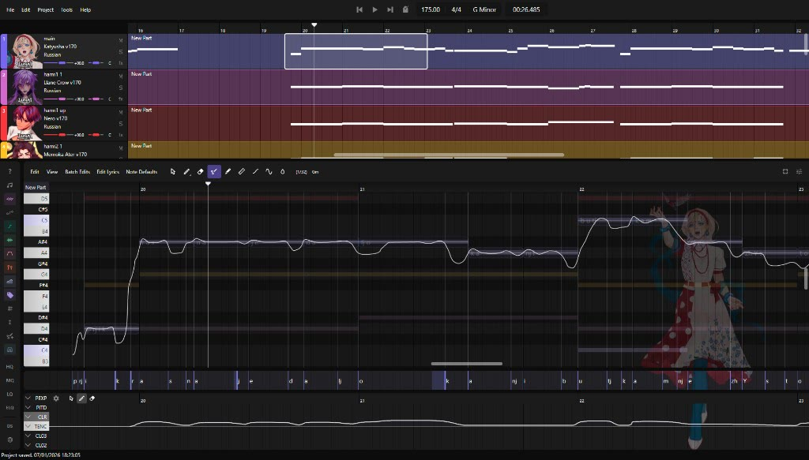

# OpenUtau Lunai

**OpenUtau Lunai** is a fork of [OpenUtau](https://github.com/openutau/OpenUtau) aimed at making DiffSinger easier and more enjoyable to use. Classic UTAU and all other voicebank types OpenUtau already supports still work as usual.

[Release](https://github.com/keirokeer/OpenUtau-lunai/releases/latest) · [Download](https://lunaiproject.github.io/editor)



## Features

Extras in this fork:

- **Refreshed UI**: redesigned welcome screen, piano roll, and dockable panels for convenient work
- **Singer Hub**: browse and install DiffSinger voicebanks from the app
- **DiffSinger quality presets**: quick HQ / MQ / LQ render profiles
- **Key & scale**: project key with in-scale highlighting on the piano roll
- **Harmony generation**: create harmony tracks from a part
- **Pitch Follow**: the piano roll follows the notes while playing
- **Live Pitch**: pitch updates as you edit notes and lyrics
- **Synthesizer V (`.svp`) import**
- Custom themes, track colors, and more


## Download

- [lunaiproject.github.io/editor](https://lunaiproject.github.io/editor)
- [GitHub Releases](https://github.com/keirokeer/OpenUtau-lunai/releases/latest)

Windows, macOS, and Linux. In-app updates when a new release is out.

## Upstream

Based on [openutau/OpenUtau](https://github.com/openutau/OpenUtau). Alongside Lunai-specific work, this fork also includes many features from upstream pull requests that are not yet released or merged into the original repository.

Credit belongs to the original OpenUtau project and to everyone listed in **Help → About OpenUtau**. See also the [Getting Started wiki](https://github.com/stakira/OpenUtau/wiki/Getting-Started).

## Support

Join our [Discord](https://discord.gg/GKSxrSd7mB) and ask in **#help**.

## Building

```sh
dotnet build OpenUtau/OpenUtau.csproj
dotnet test OpenUtau.Test/OpenUtau.Test.csproj
```


## License

Same as upstream OpenUtau (`LICENSE.txt`).
